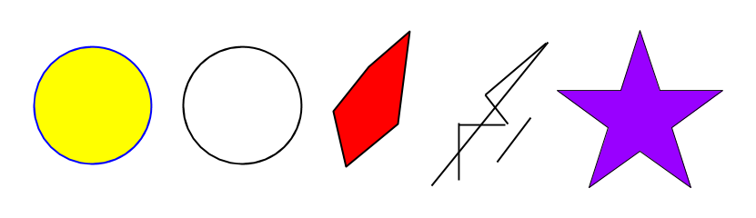

# BlockArt
Project 1 for CPSC416 Distributed Systems, UBC February 2018

This document explains how we have implemented the BlockArt project, which is specified at http://www.cs.ubc.ca/~bestchai/teaching/cs416_2017w2/project1/index.html

## Overview

The goal of the project is to implement a platform for a blockchain-based, collaborative __art-project__.
The art project consists of a single global canvas, unto which all participants can issue commands.
The main commands a user can issue are __draw__ and __delete__. In addition, a user 
can perform a number of queries to the canvas, including ink-level, blockchain-state and more. 

For a user to take part in the art-project, it must be connected to a single __miner__ in the 
__ink-mining__ network. A user connects to a miner using the miner's private key and the miner's network address. 
Miners are responsible for issuing commands on behalf of connected clients, as well as disseminating and validating
operations on a distributed blockchain. 

A user can either connect to the system through a web browser, by connecting to the webserver, implemented in ```webserver.go```, or through a Go script that imports the blockartlib library.

The mining network is maintained by the central server (```server.go```), which takes care of miner registration and handles requests from miners who need more peers. The miners have to send regular heartbeats to the central server, which keeps a list of live miners. 

<div style="text-align:center"></div>

## BlockArtLib

The ```blockartlib``` library defines the API for a client (ArtNode) to connect to a miner. 
The ArtNode&mdash;Miner connection is implemented using remote procedure calls (RPC) over a HTTP/TCP connection.


### Graphics
The ```blockartlib``` library allows two types of shapes to be drawn on the cancas, __paths__ and __circles__. 
The shapes are modelled on the SVG format. Blockartlib's ```SVGParser```-object parses user input into an internal point-based representation satisfying the ```Shape```interface. As well as arguments specifying the shape itself, we allow the two extra arguments ```fill``` and ```stroke``` to be set. The shape interface specifies two methods: ```Area()``` and ```XMLString()```. These methods are used for translating add/delete commands into operations on the mining network. Finally, the ```Intersects(shape1, shape2)``` function is used for checking if two shapes intersect. 

<div style="text-align:center"></div>
Examples of valid shapes.

## Webserver


## Mining


## Blockchain
